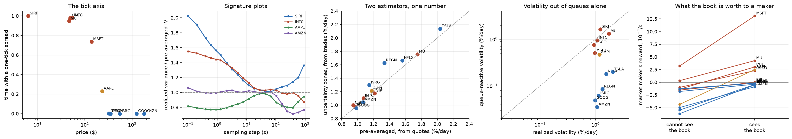

# High-frequency microstructure: price formation, market design, reinforcement learning

[](https://github.com/mohamedryadi-creator/hft-microstructure-lab/actions/workflows/ci.yml)
[](pyproject.toml)
[](LICENSE)

Eight chapters on how a price is formed, what a market maker should quote, what
an exchange should pay it, and what the order book is worth to whoever can read it — each one derived, implemented as tested code,
validated against ground truth, and then measured on **66 592 917 order-by-order
Nasdaq messages** across seven trading days and twelve symbols.

The full derivations are in a companion document **in French** (`theorie.pdf`,
kept outside this repository); the code, the API and [`REPORT.md`](REPORT.md) are
in English. Every notebook runs from the committed measurements — no download, no
credentials.



---

## The axis everything is organised around

Nasdaq's tick is one cent for every stock above a dollar, so the price level sets
how many ticks wide a spread is. A cent is 17 basis points of SIRI at \$6 and
0.06 basis points of AMZN at \$1 800. The panel runs from one to fifty ticks on
purpose, and several of the models below work on one side of that line and fail
on the other. **Saying exactly where they fail is most of the point.**

## What the data says

| Measurement | Result |
|---|---|
| **Two volatility estimators that share no data** — pre-averaged from the quotes, uncertainty-zones from the traded price on the tick grid | agree within **5.6%** on the five one-tick-spread names, and stay between 0.97 and 1.22 across all twelve |
| **The optional-stopping identity** $RV_{\rm grid}/IV = 1/(2\eta)$ | gap of **0.017–0.061** where the model applies, 0.23–0.54 where it does not — the regime boundary is visible before any volatility is compared |
| **Volatility out of queue dynamics alone**, with no price process anywhere in the model | 0.52–1.35 × the realized volatility on the one-tick-spread names; off by 9–30 × on the fifty-tick ones, which is the correct answer |
| **Order-flow endogeneity** (Hawkes branching ratio) | 0.564–1.000 over 84 symbol-days, median **0.842**, day-to-day standard deviation **0.045** |
| **Self- versus cross-excitation** $\delta = s - c$ | positive in **84 out of 84** symbol-days, 0.545–0.757: order splitting beats the reaction of the other side, so the signed flow *trends* |
| **Goodness of fit by time rescaling** | rejected everywhere — largest p-value in the whole panel is $4\times10^{-5}$ |
| **A market maker's optimal half-spread**, calibrated on measured fill intensities | **0.68 ×** the effective half-spread actually paid, where the intensity fit is credible: real makers quote wider than a model without adverse selection |
| **Reinforcement learning against the exact optimum of its own environment** | recovered to within one action-grid step at every inventory level, 98.6% of the optimal reward |
| **Book reconstruction** | **0** unknown order references in 66 592 917 messages; 99.0% of displayed trades print at or through the touch |
| **Forecasting the next price move from the book**, with a first-passage solve never fitted to a price | matches a fitted logistic regression to a **median 0.001 of AUC**, and wins outright on 3 of 12 symbols — but is badly overconfident, predicting 0.07 where the truth is 0.25 |
| **What gradient boosting on eight features adds** over a logistic regression on queue imbalance alone | **nothing**: worse on 10 of 12 symbols out of sample |
| **A market maker that cannot see the book**, quoting at the touch of a one-tick spread | **loses money**, and quoting more loses faster; one rule refusing to bid into a thin queue turns the same business profitable |
| **Where the GLFT half-spread really sits** once adverse selection is measured | between what the taker pays and what the maker keeps, on **7 of 7** symbols where the fit is credible |

### On the tick

The five names whose spread is pinned at one tick carry queues of 4–23 average
orders at the touch, and their prices move because those queues empty — the
queue-reactive mechanism reproduces their volatility from local mechanics alone.
The six whose spread is tens of ticks wide carry barely one order at the touch,
and the same mechanism under-predicts their volatility by more than an order of
magnitude, because a fifty-tick spread does not move when a queue empties. The
uncertainty-zones identity, the fill-intensity fit and the queue-reactive
volatility all change regime at the same place in the panel, which is the
strongest evidence any of them is measuring what it claims to.

### On the goodness-of-fit test

The Hawkes fits are rejected on every symbol, on every day, with p-values that
are numerically zero. That is the expected outcome and it is worth stating
plainly: a Hawkes process with a handful of exponentials is not the law of the
order flow. What survives rejection is the summary — how much of the flow
triggers itself, and in which direction — and both are stable enough across a
year to be worth quoting. A fit that could not be rejected would mean the test
had no power, not that the model was right.

## And what is validated against ground truth

| Claim | Check | Agreement |
|---|---|---|
| The ITCH decoder reads the binary correctly | An independently written encoder, field by field | exact, and a wrong message length raises |
| The book reconstruction is complete | Executions, cancels and deletes referencing an unknown order | **0** out of 66.6M messages |
| Hawkes maximum likelihood | A kernel injected into a simulation, then recovered | 0.400 true, 0.383–0.411 recovered |
| The time-rescaling test has power | Same data against a Poisson null | p < 10⁻¹⁰ |
| The closed-form signature plot | Against a quadrature of the spectrum, over five decades of scale | 1.6 × 10⁻⁹ relative |
| … and against a simulated price | Monte Carlo of the same model | within 1% at every scale |
| Volatility estimator convergence rates | Monte Carlo, log RMSE against log n | −0.166 / −0.249 / −0.191 against −1/6, −1/4, −1/5 |
| The uncertainty-zone parameter | A path simulated with a chosen η | recovered as the grid refines |
| The optional-stopping identity RV/IV = 1/(2η) | Simulation, then real data | exact in simulation; 0.02–0.06 on large-tick names |
| The market-making closed form | Value iteration on the discretised problem | within one action-grid step |
| Q-learning | Against the exact optimum of its own environment | within one grid step at every inventory |
| The maker's ergodic gain λ_max/k | Against value iteration | 0.4217 vs 0.4214 |
| The fee model at zero rebate | Against the market-making chapter | identical |

**82 tests**, all passing, none touching the network. **Eight notebooks**, executed
with outputs committed, each carrying `assert` checkpoints — a notebook that runs
has verified its own results.

## The method: two legs, and neither works alone

**A simulator proves the estimator is correct.** Inject a kernel, a volatility, an
η, a set of intensities that you chose, and check the estimator hands them back.
That tests the algebra and its transcription — nothing else.

**Real data says what the market does.** An estimator validated only on synthetic
data says nothing about the world. A measurement whose estimator was never
validated says nothing at all.

## The chapters

| | | |
|---|---|---|
| **01** | [Book reconstruction and tick regimes](notebooks/01_book_reconstruction_and_tick_regimes.ipynb) | the wire format, the book, the panel, and the aggressor-side check |
| **02** | [Hawkes processes for the order flow](notebooks/02_hawkes_order_flow.ipynb) | concave maximum likelihood, a goodness-of-fit test that rejects, and a signature plot in closed form |
| **03** | [Realized volatility, noise and the tick](notebooks/03_realized_volatility_noise_and_the_tick.ipynb) | three estimators at three measured rates, and the tick grid as an observation |
| **04** | [The queue-reactive model](notebooks/04_queue_reactive_model.ipynb) | volatility as an output of the book's local mechanics |
| **05** | [Market making, closed form and RL](notebooks/05_market_making_closed_form_and_rl.ipynb) | the eigenvector solution, and a learner required to find it |
| **06** | [Make-take fees as a principal-agent problem](notebooks/06_make_take_fees_principal_agent.ipynb) | what an exchange should pay for a tighter spread |
| **07** | [What the book predicts](notebooks/07_what_the_book_predicts.ipynb) | a first-passage solve that forecasts prices without being fitted to one, against models that were |
| **08** | [An agent in a reacting book](notebooks/08_agent_in_a_reacting_book.ipynb) | market making where adverse selection is endogenous, and the measured price of being blind |

The written account, with the tables and the interpretation, is
[**REPORT.md**](REPORT.md).

## Findings that contradicted the plan

Documented rather than smoothed over — the full list is in
[§10 of the report](REPORT.md#10-findings-that-contradicted-the-plan).

- **Match numbers do not group a sweep.** Nasdaq gives every print its own: 89 735
  AAPL executions, 89 735 distinct match numbers. What groups them is the
  nanosecond timestamp.
- **The queue-reactive model needs real order sizes.** The textbook ±1
  birth-death chain predicts 3 617 seconds between INTC price changes against a
  measured 1.6. Drawing sizes from the measured distribution gives 1.50.
- **The two-scale estimator's subgrids must span the day**, or they carry a
  −3.6% bias larger than the estimator's own error — visible with the noise
  switched off entirely.
- **A rebate does not translate the quoting schedule.** The test that asserted it
  failed; what is exactly true is that the *round trip* absorbs the rebate,
  $\delta^b(q)+\delta^a(q+1) = 2/k - 2z$.
- **Value-based reinforcement learning cannot solve the market-making problem
  here, and the reason is arithmetic.** The per-step reward is dominated by
  marking inventory across a price move — standard deviation near $3\times10^{-2}$
  against a policy difference near $2\times10^{-5}$ — so a value function needs
  ~$10^6$ samples per state-action cell. Tabular Q-learning undertrades, a DQN's
  loss *rises* through training, and direct policy comparison on common random
  numbers resolves the same effect at tens of standard errors.
- **The queue-reactive environment inherits its parent's runaway.** Left alone,
  every simulated book climbs into the states where the estimated intensities
  imply a drift of +47 average sizes per second — an artifact of a few seconds'
  residence time a day — and freezes there. The environment is capped at the
  queue size below which the real book spends 99% of its day.

## The data

Nasdaq publishes seven complete TotalView-ITCH 5.0 days at
[emi.nasdaq.com](https://emi.nasdaq.com/ITCH/Nasdaq%20ITCH/) — every add,
execute, cancel, delete and replace for every Nasdaq-listed security, with
nanosecond timestamps and order references. Three properties make the study
possible: it is order by order, so a specific order can be followed to its fill;
the aggressor side is known rather than inferred; and there is a real tick.

The extraction streams each file from the socket and never writes it to disk.
About 31 GB is transferred and 90 GB inflated; 580 MB of parquet lands, and only
the derived measurements — about 1.5 MB — are committed. No raw data is
redistributed; see [`NOTICE`](NOTICE).

## Running it

```bash
make setup        # install the package and the test dependencies
make test         # tests, no network
make data         # stream the seven ITCH days   (~90 min, ~31 GB transferred)
make study        # rebuild results/ from the extracted messages   (~25 min)
make learn        # chapter 07: fit and score the book's predictability (~10 min)
make agents       # chapter 08: search the quoting policies            (~50 min)
make build        # regenerate the notebooks from source
make notebooks    # execute them all from a clean kernel
```

Only `make data` touches the network. `make setup-deep` adds `torch` for the deep
agent of chapter 08; nothing else needs it, the tests skip it when it is absent,
and CI never installs it.

## Layout

```
src/hfx/
  itch/       the wire format, a streaming decoder, and the encoder it is checked against
  book/       order-by-order reconstruction, queue tracking, trade grouping
  hawkes/     simulation, concave maximum likelihood, time-rescaling, the spectrum
  vol/        realized variance under noise, and the uncertainty-zones model
  queue/      the queue-reactive model: intensities, sizes, simulator
  mm/         the closed form, the discretised MDP, the Q-learner, the reacting
              book environment, its policy search, and an optional deep agent
  predict/    first-passage on the two-queue chain, features, and the models
  design/     make-take fees as a Stackelberg problem
  pipeline/   the panel, the extraction, and the study
notebooks/    01..08, thin, executed, outputs committed
results/      panel.csv, curves.npz, learning.* and agents.* -- what makes the
              notebooks run offline
tests/        82 tests, none touching the network
```

## References

Avellaneda & Stoikov (2008) · Bacry, Delattre, Hoffmann & Muzy (2013) ·
Barndorff-Nielsen, Hansen, Lunde & Shephard (2008) · Dayri & Rosenbaum (2015) ·
El Euch, Mastrolia, Rosenbaum & Touzi (2021) · Guéant, Lehalle &
Fernandez-Tapia (2013) · Hardiman, Bercot & Bouchaud (2013) · Huang, Lehalle &
Rosenbaum (2015) · Jacod, Li, Mykland, Podolskij & Vetter (2009) · Robert &
Rosenbaum (2011) · Zhang, Mykland & Aït-Sahalia (2005)
